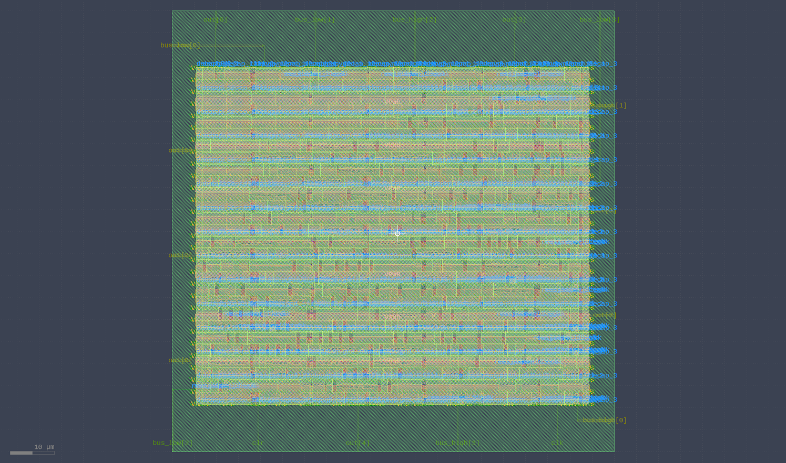
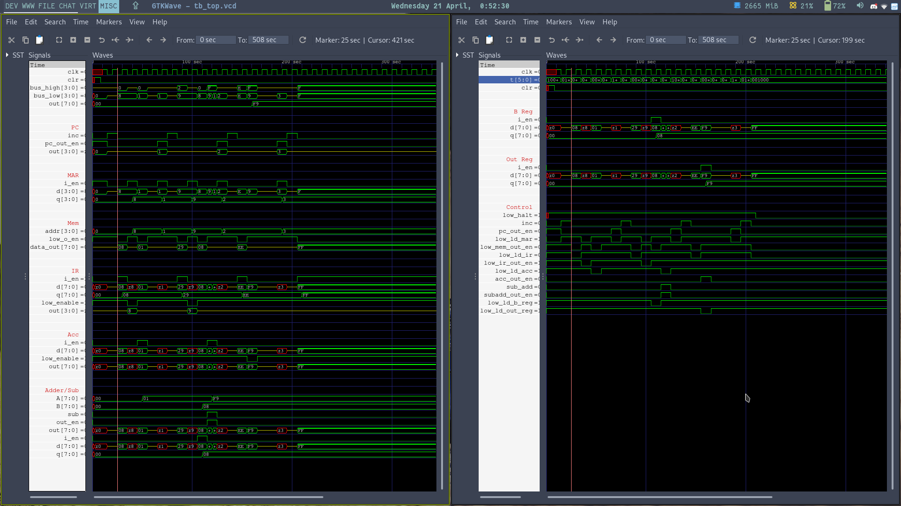
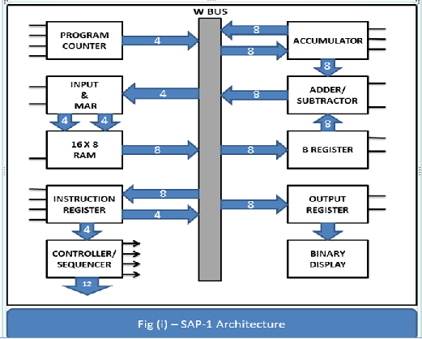
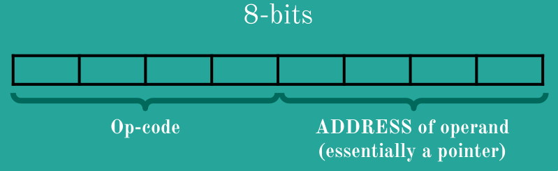
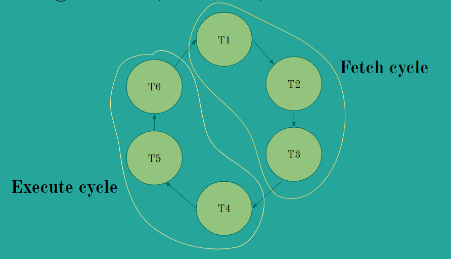

# SAP-1 Computer in Verilog HDL

This design is GDSII ready (although there are a few `MAX_FANOUT` violations to
sort out) using the [SkyWater 130nm
PDK](https://github.com/google/skywater-pdk) and the
[OpenLane](https://github.com/The-OpenROAD-Project/OpenLane) RTL-to-GDSII flow
that is part of the [OpenROAD
project](https://github.com/The-OpenROAD-Project/OpenROAD).

To run the flow yourself,
* Set up the environment as shown in the OpenLane
  [documentation](https://openlane.readthedocs.io/).
* Use the provided
  [`config.tcl`](./config.tcl).
* Copy the contents of the
  [`hdl/`](./hdl) directory to the
  `src/` directory in your OpenLane design environment.

||
|:-:|
|[Klayout](https://www.klayout.de/doc.html) GDSII view|

Edit the contents of
[`hdl/rom16_8bit.v`](./hdl/rom16_8bit.v)
to change the program as this computer is programmed directly in ROM.

||
|:-:|
|Waveform output for default program|

## Directory structure

The following structure is followed:

```
    .
    ├── hdl
    ├── test
    └── img
```

- All Verilog modules are located in the `hdl` directory
    -   Only **ONE** Verilog module exists per `.v` file
-   All Verilog test-benches are located in the `test` directory
    -   Filenames for testbenches are prefixed with `tb`
        -   E.g. `dff_posedge.v -> tb_dff_posedge.v`
    -   Output files (`*.out`) after compilation are also located in the `test` directory
-   Waveform dumps are put in the `simulation` directory (create it if it
    doesn't exist).
- Any images used are placed in the `img` directory

## Compilation

* `iverilog` is used to compile and test the code. To view waveforms, use a program like `gtkwave`.

There are two helper scripts to simplify this step.

To compile, use the `compile.sh` script. Usage is as follows:

```sh
# To compile all files in the test directory
$ ./compile.sh

# To compile specific files
$ ./compile.sh FILE1 FILE2 ...
```

To run compiled files, use the `run.sh` script.
Usage is as follows:

```sh
# To run all compiled files in the test/ directory
$ ./run.sh

# To run compiled files
$ ./run.sh FILE1 FILE2 ...
```
To open waveform dump (`gtkwave` is used here): `gtkwave <path-to-vcd-file>`

## Introduction to the SAP-1

- The SAP (Simple-As-Possible)-1 Computer is an 8-bit computer capable of
  performing simple operations such as add and subtract two numbers.

- The SAP-1 employs a processing unit (ALU + Registers), a control unit, memory
  to store data and instructions and a central bus.

- It is a **stored-program** computer in which fetch and execute cycles occur
  separately as they share a common bus.

- It is built using the bottom-up approach where all the sub-modules are
  constructed initially and finally assembled to deploy a working computer.

## The architecture

The figure below represents the architecture of SAP-1 computer.


||
|:-:|
|SAP-1 Architecture|

The architecture of SAP-1 has the following components:
* Program Counter
* Memory Address Register
* Memory
* Instruction Register
* Controller-Sequencer
* Accumulator
* Adder-Subtractor
* B-Register
* Output Register

## The instruction set

> "When software talks to hardware, it has a vocabulary. The words are called
> instructions, and the vocabulary is called the Instruction Set Architecture
> (ISA)"
>
> -- David Patterson



| Mnemonic | Operation | Op-code |
|:---:|:---:|:---:|
|LDA|Load RAM data into Accumulator|0000|
|ADD|Add RAM data into Accumulator|0001|
|SUB|Subtract RAM data from Accumulator|0010|
|OUT|Load Accumulator data into Output Register|1110|
|HLT|Stop processing|1111|

## Working

### The Fetch & Execute Cycle

Every instruction and required data has to be fetched from the memory.

Correspondingly, the processor executes the instruction and outputs the result using the output register.

This process happens in two cycles, i.e. Fetch & Execute across six different timing states accounted by a 6-bit ring-counter.

||
|:-:|
|"T-states" (timing states)|

### Control signals

The controller-sequencer outputs `12` different control signals which are key to the computer's automatic operation.
Every signal supervises and tells the computer about what needs to be done at what stage.
All the signals are listed below:

* `inc` = INCREMENT
* `pc_out_en` = OUTPUT ENABLE OF PROGRAM COUNTER
* `low_ld_mar` = LOAD MAR
* `low_mem_out_en` = CHIP ENABLE FOR RAM
* `low_ld_ir` = LOAD INSTRUCTION REGISTER
* `low_ir_out_en` = OUTPUT ENABLE OF INSTRUCTION REGISTER
* `low_ld_acc` = LOAD ACCUMULATOR
* `acc_out_en` = OUTPUT ENABLE OF ACCUMULATOR
* `sub_add` = SUBTRACTION/ADDITION
* `subadd_out_en` = OUTPUT ENABLE OF SUBTRACTION/ADDITION
* `low_ld_b_reg` = LOAD B REGISTER
* `low_ld_out_req` = LOAD OUTPUT REGISTER
* `low_halt` = HALT EXECUTION

## Inspiration

Inspired by [Ben Eater's](https://www.youtube.com/user/eaterbc) [8-bit Computer](https://www.youtube.com/playlist?list=PLowKtXNTBypGqImE405J2565dvjafglHU)

## More Information

* [YouTube Playlist on SAP-1](https://www.youtube.com/playlist?list=PLbUnUWOWn7M8QmODC1wdVhVPlP_u4FwBc)
* [Simulation of SAP-1](https://circuitverse.org/users/3903/projects/sap-1-6896132f-12e6-416f-afb9-b986b354eda3)
* **Digital Computer Electronics** by Albert Paul Malvino & Jerald A. Brown
* **Advanced Digital Design with the Verilog HDL** by Michael D. Ciletti
* **Verilog HDL: A Guide To Digital Design & Synthesis** by Samir Palnitkar
* [OpenROAD website](https://theopenroadproject.org/)
* [OpenLane documentation](https://openlane.readthedocs.io/)
* [Google SkyWater PDK documentation](https://skywater-pdk.readthedocs.io/en/main/)

## Contributing

* Fork this repo, and create a new branch for the feature you are developing
* Take a look at the [TODO](./TODO.md)
* Keep the directory structure as it is.
* Enable [editorconfig](https://editorconfig.org/) for your editor to take care of formatting
* Keep commit messages concise and meaningful
