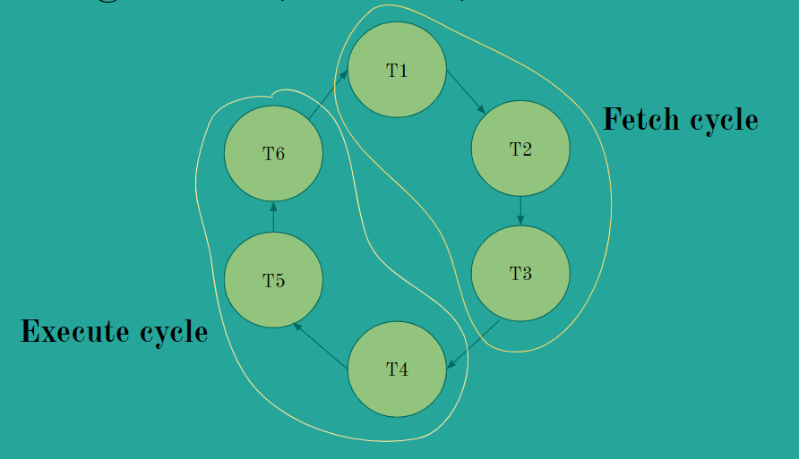

# SAP-1 Computer in Verilog HDL

## Directory structure

Below is the structure of how the verilog modules are arranged in this repository.

```
    .
    ├── README.md
    ├── hdl
    │   └── dff_posedge.v
    ├── simulation
    └── test
        └── tb_dff_posedge.v
```

- All Verilog modules are located in the `hdl` directory
    -   Only **ONE** Verilog module exists per `.v` file
-   All Verilog test-benches are located in the `test` directory
    -   Filenames should are prefixed with `tb`
        -   E.g. `dff_posedge.v - tb_dff_posedge.v`
    -   Output files (`.out`) after compilation also are located in the `test` directory.out` extension
-   All Verilog simulation output (`vcd` dumps for waveforms etc.) are located in the `simulation` directory.

## Compilation

* `iverilog` is used to compile and test the code. To view waveforms, use a program like `gtkwave`.

There are two helper scripts to simplify this step.

To compile, use the `compile.sh` script. Usage is as follows:

```sh
# To compile all files in the test directory
$ ./compile.sh

# To compile select files
$ ./compile.sh FILE1 FILE2 ...
```

To run compiled files, use the `run.sh` script.
Usage is as follows:

```sh
# To run all compiled files in the test/ directory
$ ./run.sh

# To run select files
$ ./run.sh FILE1 FILE2 ...
```
To open waveform dump (`gtkwave` is used here): `gtkwave <path-to-vcd-file>`

## Introduction to SAP

The SAP (Simple-As-Possible)-1 Computer is an 8-bit computer capable of performing simple operations such as add and subtract two numbers.

The SAP-1 employs a processing unit (ALU + Registers), a control unit, memory to store data and instructions and a central bus.

It is a **stored-program** computer in which fetch and execute cycles occur separately as they share a common bus.

It is built using the bottom-up approach where all the sub-modules are constructed initially and finally assembled to deploy a working computer.

## SAP-1 Architecture

The figure below represents the architecture of SAP-1 computer.


The architecture of SAP-1 has the following components:
* Program Counter
* Memory Address Register
* Memory
* Instruction Register
* Controller-Sequencer
* Accumulator
* Adder-Subtractor
* B-Register
* Output Register

## SAP-1 Instruction Set


An instruction set is necessary to program the counter. The table below describes the functionality of each instruction.

| Mnemonic | Operation |
|:---:|:---:|
|LDA|Load RAM data into Accumulator|
|ADD|Add RAM data into Accumulator|
|SUB|Subtract RAM data from Accumulator|
|OUT|Load Accumulator data into Output Register|
|HLT|Stop processing|

### Op-Codes

Each instruction has a binary equivalent op-code which must be loaded to the
computer's memory. The table below represents each instruction along with it's
op-code.

| Mnemonic | Op-code |
|:---:|:---:|
|LDA|0000|
|ADD|0001|
|SUB|0010|
|OUT|1110|
|HLT|1111|

## SAP-1 Working

### The Fetch & Execute Cycle

Every instruction and required data has to be fetched from the memory.

Correspondingly, the processor executes the instruction and outputs the result using the output register.

This process happens in two cycles, i.e. Fetch & Execute across six different timing states accounted by a 6-bit ring-counter (first three states for Fetch Cycle and next three for the Execute Cycle).



### Control signals

The controller-sequencer outputs `12` different control signals which are key to the computer's automatic operation.
Every signal supervises and tells the computer about what needs to be done at what stage.
All the signals are listed below:

+ `inc` = INCREMENT
+ `pc_out_en` = OUTPUT ENABLE OF PROGRAM COUNTER
+ `low_ld_mar` = LOAD MAR
+ `low_mem_out_en` = CHIP ENABLE FOR RAM
+ `low_ld_ir` = LOAD INSTRUCTION REGISTER
+ `low_ir_out_en` = OUTPUT ENABLE OF INSTRUCTION REGISTER
+ `low_ld_acc` = LOAD ACCUMULATOR
+ `acc_out_en` = OUTPUT ENABLE OF ACCUMULATOR
+ `sub_add` = SUBTRACTION/ADDITION
+ `subadd_out_en` = OUTPUT ENABLE OF SUBTRACTION/ADDITION
+ `low_ld_b_reg` = LOAD B REGISTER
+ `low_ld_out_req` = LOAD OUTPUT REGISTER
+ `low_halt` = HALT EXECUTION

## Inspiration

Inspired by [Ben Eater's](https://www.youtube.com/user/eaterbc) [8-bit Computer](https://www.youtube.com/playlist?list=PLowKtXNTBypGqImE405J2565dvjafglHU)

## More Information

+ [YouTube Playlist on SAP-1](https://www.youtube.com/playlist?list=PLbUnUWOWn7M8QmODC1wdVhVPlP_u4FwBc)
+ [Simulation of SAP-1](https://circuitverse.org/users/3903/projects/sap-1-6896132f-12e6-416f-afb9-b986b354eda3)
+ **Digital Computer Electronics** by Albert Paul Malvino & Jerald A. Brown
+ **Advanced Digital Design with the Verilog HDL** by Michael D. Ciletti
+ **Verilog HDL: A Guide To Digital Design & Synthesis** by Samir Palnitkar
